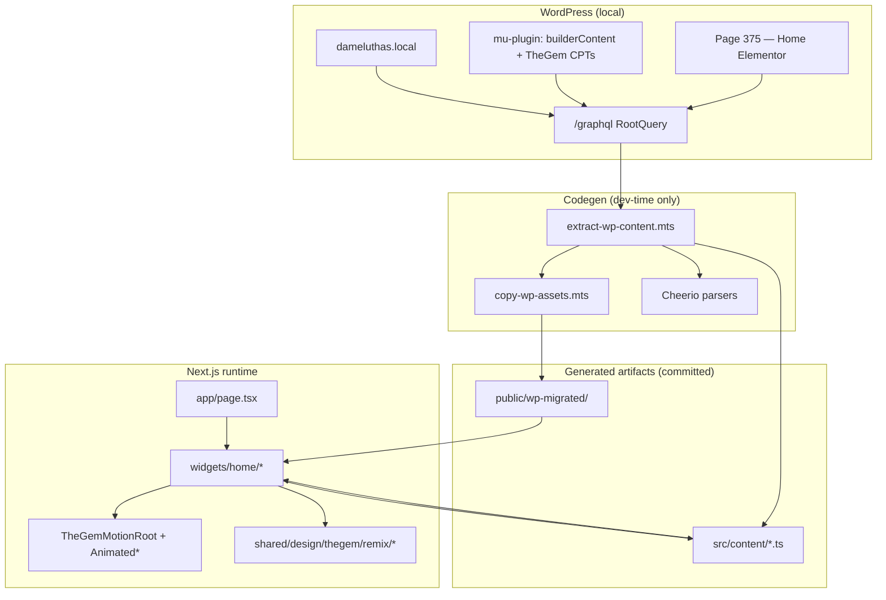
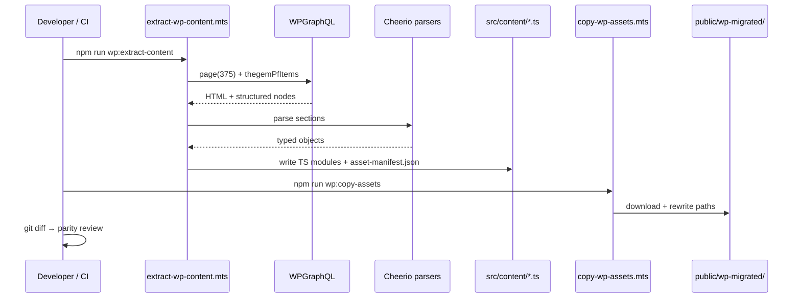

# Technical Solution Architecture — Homepage GraphQL Codegen Migration

> **CORTEX artifact:** `artifact:dame-luthas-app:graphql-codegen-tsa`  
> **Session:** `sess_dame_luthas__20260611_dfd07f`  
> **Task:** `task_luthas_wp_006` (in progress)  
> **Last updated:** 2026-06-11  
> **Repo:** `dame-luthas-app`  
> **WP source:** `http://dameluthas.local/graphql`  
> **Homepage:** Page ID **375** (`isFrontPage: true`, title "Home")

---

## 1. Executive summary

Dame Luthas homepage parity requires migrating **eight Elementor/TheGem section bands** from WordPress into native React widgets. REST page-meta endpoints are locked down (404, no `_elementor_data`). **WPGraphQL is live** and returns fully rendered homepage HTML (~156 KB) plus structured portfolio CPT data.

**Decision:** Use a **one-time TypeScript codegen pipeline** (not a runtime WP data layer). Scripts query GraphQL, parse HTML where no CPT exists, emit typed content modules, and download static assets. React components consume generated files; animations remain hand-wired via the existing TheGem remix system (`TheGemMotionRoot`, `AnimatedHeading`, `AnimatedButton`).

**Outcome:** Repeatable migration — re-run codegen → `git diff` shows WP drift for parity sign-off. Zero production dependency on `dameluthas.local`.

---

## 2. Problem statement

| Constraint | Detail |
|---|---|
| REST blocked | Page meta / Elementor JSON not exposed via REST |
| GraphQL works | `RootQuery` at `/graphql`; mu-plugin exposes `builderContent` + TheGem CPTs |
| Wrong homepage ID | Page 14 was a red herring; **375** is `isFrontPage: true` |
| Current Next gap | `src/app/page.tsx` renders only `Hero` + `PortfolioGrid` when migrated content exists |
| Animation system fixed | Headings/buttons use `useInViewTrigger` + `html.thegem-motion-ready` — content swap must not break triggers |

---

## 3. Current vs target state

### 3.1 Current pipeline (Phase 1 — shipped)

```
wp:install-graphql → wp:extract-live → wp:migrate → data/migrated/content.json
                                                          ↓
                                              loadMigrated() in widgets
```

- **Extract:** `scripts/wp/extract-content.mts` — bulk GraphQL pull to `data/extracted/`
- **Migrate:** `scripts/wp/migrate-content.mts` — snapshot → `content.json` (hero, nav, portfolio, templates, about/contact)
- **Gap:** Homepage sections beyond hero are **not** parsed from page 375 HTML

### 3.2 Target pipeline (Phase 2 — this TSA)

```
                    ┌─────────────────────────────────────┐
                    │  WPGraphQL (dameluthas.local)       │
                    └──────────────┬──────────────────────┘
                                   │
         ┌─────────────────────────┼─────────────────────────┐
         │                         │                         │
         ▼                         ▼                         ▼
  page(375)              thegemPfItems              menus (nav only)
  content +              structured CPT             dameluthas-main-menu
  builderContent
         │
         ▼
  extract-wp-content.mts
  ├── GraphQL fetch
  ├── Cheerio HTML parsers (sections without CPT)
  └── TypeScript emit
         │
         ├── src/content/services.ts
         ├── src/content/clients.ts
         ├── src/content/testimonials.ts
         ├── src/content/sections.ts
         └── src/content/portfolio.ts (optional; may defer to content.json)
         │
         ▼
  assets:convert + copy-portfolio-video
  └── public/assets/{domain}/** + converted-assets.json
         │
         ▼
  Native widgets (src/widgets/home/*)
  └── page.tsx composes full homepage
```

---

## 4. System architecture



### 4.1 Layer responsibilities

| Layer | Responsibility | WP dependency at runtime |
|---|---|---|
| **Codegen scripts** | Fetch, parse, emit, download assets | None (dev machine only) |
| **`src/content/`** | Typed static content SSOT | None |
| **`src/widgets/home/`** | Presentational section components | None |
| **`src/shared/ui/Animated*`** | Motion triggers, a11y, reduced-motion | None |
| **`data/migrated/content.json`** | Legacy bundle (hero, nav, portfolio shell) | None — merge or supersede per section |
| **`public/assets/`** | Converted static media (webp/svg/webm) | None — served by Next static |

---

## 5. GraphQL data source matrix

Probe command: `npm run wp:probe-schema`

| Data need | GraphQL source | Structured? | Parser strategy |
|---|---|---|---|
| Homepage hero copy | Page 375 `content` | Partial (HTML) | Existing `migrate-content.mts` hero derivation **or** dedicated hero parser |
| Service card columns | Page 375 `content` | **No** — `thegem-menu-custom` widgets | Cheerio: `.thegem-menu-custom` |
| Rotating subtitles | Page 375 `content` | **No** | Cheerio: `.rotating-text`, `.thegem-heading-rotating` |
| Client logos | Page 375 `content` | **No** — `gem-client` | Cheerio: `.gem-client`, `.gem-client-item` |
| Testimonials | Page 375 `content` | **No CPT** (`testimonials` probe ❌) | Cheerio: `.gem-testimonials`, `.gem-testimonial-item` |
| UN advisor / manifesto bands | Page 375 `content` | **No** | Cheerio: section containers by Elementor `data-id` or heading anchors |
| Portfolio grid | `thegemPfItems` | **Yes** | GraphQL only — already in `extract-content.mts` |
| Main navigation | `menus` → `menuItems` | **Yes** | 1 menu: Home, Case Studies, Contact |
| Header/footer templates | `thegemTemplates`, `thegemFooters` | **Yes** | Already migrated |
| Media URLs | Embedded in HTML + `mediaItems` | Mixed | `copy-wp-assets.mts` |

### 5.1 Confirmed non-sources

- Page ID **14** — not front page; do not query for homepage content
- `menuItems` for service cards — **incorrect** on this site; only main nav menu exists
- CPT probes ❌: `clients`, `testimonials`, `thegemClients`, `gemClients`, `properties`
- `agents` CPT — field exists, **0 nodes**

### 5.2 Page 375 payload sizes (verified)

| Field | Size | Use |
|---|---|---|
| `content(format: RENDERED)` | ~156 KB | Primary parse source (browser-parity HTML) |
| `builderContent` | ~33 KB | Secondary — Elementor widget settings if needed for animation class names |

**Recommendation:** Parse **`content`** first. Fall back to `builderContent` only when a widget setting is stripped from rendered output.

---

## 6. Homepage section inventory (8 bands)

Mapped from WP HTML markers + visual QA vs `data/screenshots/wp-reference/`.

| # | Section | WP marker / widget | Next widget (proposed) | Content source |
|---|---|---|---|---|
| 1 | Hero | `AnimatedHeading`, CTAs, hero image | `Hero.tsx` ✅ exists | `content.json` hero — refine from page 375 |
| 2 | Services intro + 3 columns | `thegem-menu-custom` × 3 | `ServiceCardsSection.tsx` | Cheerio → `services.ts` |
| 3 | Rotating value props | `rotating-text`, `thegem-heading-rotating` | `RotatingHeadlineSection.tsx` | Cheerio → `sections.ts` |
| 4 | UN advisor band | Elementor section (heading + body) | `AdvisorSection.tsx` | Cheerio → `sections.ts` |
| 5 | Manifesto / philosophy | Full-width text band | `ManifestoSection.tsx` | Cheerio → `sections.ts` |
| 6 | Client logos | `gem-client` slider | `ClientLogosSection.tsx` | Cheerio → `clients.ts` |
| 7 | Testimonials | `gem-testimonials` | `TestimonialsSection.tsx` | Cheerio → `testimonials.ts` |
| 8 | Portfolio | `thegem-portfolio` | `PortfolioGrid.tsx` ✅ exists | `thegemPfItems` GraphQL |

**Current Next homepage (`page.tsx`):** sections 1 (partial) + 8 only.

---

## 7. TypeScript content model

### 7.1 `src/content/types.ts`

```typescript
export interface ServiceMenuItem {
  label: string;
  href: string;
  description?: string; // badge / subtitle text from menu item inner HTML
}

export interface ServiceCardColumn {
  id: string;
  title: string;
  image: string;
  items: ServiceMenuItem[];
}

export interface ClientLogo {
  name: string;
  src: string;
  href?: string;
}

export interface Testimonial {
  quote: string;
  author: string;
  role?: string;
  image?: string;
}

export interface RotatingPhrase {
  text: string;
  animationClass?: string; // e.g. thegem-heading-rotating variant
}

export interface ContentSection {
  id: string;
  kind: "advisor" | "manifesto" | "cta-band" | "raw-html-fallback";
  eyebrow?: string;
  title?: string;
  bodyHtml?: string; // sanitized subset only when native JSX not worth it
  bodyText?: string;
  image?: string;
}

export interface HomepageContent {
  generatedAt: string;
  sourcePageId: 375;
  services: ServiceCardColumn[];
  clients: ClientLogo[];
  testimonials: Testimonial[];
  rotatingPhrases: RotatingPhrase[];
  sections: ContentSection[];
}
```

### 7.2 Emit format

Generated files use **const exports + `satisfies`** for compile-time validation:

```typescript
// src/content/services.ts — AUTO-GENERATED by extract-wp-content.mts
import type { ServiceCardColumn } from "./types";

export const serviceCards = [
  { id: "ai-social-impact", title: "AI for Social Impact", /* ... */ },
] as const satisfies readonly ServiceCardColumn[];
```

**Do not** emit JSON at runtime load path — TypeScript modules tree-shake and give IDE autocomplete in widgets.

---

## 8. Script specifications

### 8.1 `scripts/wp/extract-wp-content.mts`

**Dependencies to add:** `cheerio`, `graphql-request` (or reuse `scripts/wp/lib/graphql-client.ts`)

**CLI:**

```bash
npm run wp:extract-content          # default: page 375
npm run wp:extract-content -- --dry-run
npm run wp:extract-content -- --page-id=375
```

**Execution flow:**

1. **Fetch** page 375 via GraphQL:
   ```graphql
   query Homepage($id: ID!) {
     page(id: $id, idType: DATABASE_ID) {
       databaseId title isFrontPage
       content(format: RENDERED)
       builderContent
     }
   }
   ```
2. **Fetch** portfolio (if not reusing `data/extracted/portfolio.json`):
   ```graphql
   { thegemPfItems(first: 100) { nodes { databaseId title slug content excerpt ... } } }
   ```
3. **Parse HTML** with Cheerio modules in `scripts/wp/lib/parsers/`:
   - `parse-service-cards.ts` — `.thegem-menu-custom` blocks
   - `parse-clients.ts` — `.gem-client`
   - `parse-testimonials.ts` — `.gem-testimonials`
   - `parse-rotating-text.ts` — rotating headline widgets
   - `parse-sections.ts` — advisor/manifesto by section heuristics
4. **Collect asset URLs** from parsed nodes → `data/extracted/asset-manifest.json`
5. **Emit** `src/content/*.ts` + `src/content/index.ts` barrel
6. **Write report** `data/extracted/extract-report.json` (counts, warnings, unmatched selectors)

**Parser heuristics (service cards):**

```typescript
// Pseudocode — refine selectors against live HTML audit
doc.querySelectorAll(".thegem-menu-custom").forEach((el, i) => {
  const title = el.querySelector(".menu-custom-title, h3")?.textContent;
  const image = el.querySelector("img")?.getAttribute("src");
  const items = [...el.querySelectorAll(".menu-custom-item a, .thegem-menu-item")].map(/* ... */);
});
```

### 8.2 `scripts/wp/copy-wp-assets.mts`

**Input:** `data/extracted/asset-manifest.json` (from extract step)

**Output:** `public/wp-migrated/{year}/{month}/{filename}` mirroring WP uploads structure

**Behavior:**

1. Download from `http://dameluthas.local/wp-content/uploads/...` (or local `LOCAL_WP_PUBLIC`)
2. Skip if file exists with matching SHA-256 (idempotent)
3. Rewrite URLs in emitted content TS to `/wp-migrated/...`
4. Log missing 404s to `data/extracted/asset-errors.json`

**Known assets (from audit):**

| Asset | WP path (approx) |
|---|---|
| Hero variants | `home-03.webp`, `home-04.webp`, `home-05.webp` |
| Quote icon | `quote-dark.png` |
| Decorative | `circle-dark.svg` |
| Client logos | 6× under `uploads/` (discovered by parser) |

### 8.3 `package.json` scripts (to add)

```json
{
  "wp:extract-content": "npx tsx scripts/wp/extract-wp-content.mts",
  "wp:copy-assets": "npx tsx scripts/wp/copy-wp-assets.mts",
  "wp:codegen": "npm run wp:extract-content && npm run wp:copy-assets"
}
```

**Full refresh pipeline:**

```bash
npm run wp:install-graphql
npm run wp:extract-live      # bulk extract (existing)
npm run wp:migrate           # content.json (existing)
npm run wp:codegen           # NEW — homepage typed content + assets
npm run wp:screenshots:next  # parity check
```

---

## 9. Widget architecture (FSD)

```
src/
├── content/                    # GENERATED — do not hand-edit
│   ├── types.ts               # HAND-MAINTAINED schemas
│   ├── services.ts
│   ├── clients.ts
│   ├── testimonials.ts
│   ├── sections.ts
│   └── index.ts
├── widgets/
│   ├── Hero.tsx               # existing
│   ├── PortfolioGrid.tsx      # existing
│   └── home/
│       ├── ServiceCardsSection.tsx
│       ├── RotatingHeadlineSection.tsx
│       ├── AdvisorSection.tsx
│       ├── ManifestoSection.tsx
│       ├── ClientLogosSection.tsx
│       └── TestimonialsSection.tsx
└── app/
    └── page.tsx               # compose all sections
```

### 9.1 `page.tsx` target composition

```tsx
import { serviceCards, clients, testimonials, rotatingPhrases, sections } from "@/content";
import { Hero } from "@/widgets/Hero";
import { ServiceCardsSection } from "@/widgets/home/ServiceCardsSection";
// ...

export default function HomePage() {
  const { portfolio } = loadMigrated(); // or @/content/portfolio when migrated
  return (
    <main>
      <Hero />
      <ServiceCardsSection columns={serviceCards} />
      <RotatingHeadlineSection phrases={rotatingPhrases} />
      <AdvisorSection section={sections.find(s => s.id === "un-advisor")} />
      <ManifestoSection section={sections.find(s => s.id === "manifesto")} />
      <ClientLogosSection logos={clients} />
      <TestimonialsSection items={testimonials} />
      <PortfolioGrid items={portfolio} title="Selected work" />
    </main>
  );
}
```

### 9.2 Animation contract

Every text element that had TheGem heading animation in WP must use:

```tsx
<AnimatedHeading variant="letters-slide-up" text={...} />
```

Map WP classes → variants using `homepage-inventory.ts` SSOT:

| WP class | `AnimatedHeading` variant |
|---|---|
| `thegem-heading-letters-slide-up` | `letters-slide-up` |
| `thegem-heading-words-slide-left` | `words-slide-left` |
| `thegem-heading-fade-simple` | `fade-simple` |
| `thegem-heading-rotating` | custom `RotatingHeadlineSection` |

Buttons: `AnimatedButton` with `variant="fade-left"` etc.

**CSS:** Import remixed sheets from `src/shared/design/thegem/index.css` — widgets add TheGem structural classes (`dl-gem-portfolio-card`, `thegem-menu-custom` remix equivalents) via `p8-hovers-scope.ts` ported set.

---

## 10. Migration steps (ordered)

### Phase A — Foundation (complete ✅)

| Step | Action | Status |
|---|---|---|
| A1 | Local WP + WPGraphQL live | ✅ |
| A2 | Mu-plugin `dameluthas-headless-graphql.php` | ✅ |
| A3 | `extract-content.mts` + `migrate-content.mts` | ✅ |
| A4 | Native Header/Footer/Contact/About widgets | ✅ |
| A5 | TheGem animation trigger fix (`TheGemMotionRoot`) | ✅ |
| A6 | Schema probe `wp:probe-schema` | ✅ |
| A7 | Confirm homepage ID 375 | ✅ |

### Phase B — Codegen pipeline (next)

| Step | Action | Owner | Acceptance |
|---|---|---|---|
| B1 | Add `cheerio` devDependency | Agent | `npm install` clean |
| B2 | Create `scripts/wp/lib/parsers/*` | Agent | Unit smoke on saved HTML fixture |
| B3 | Implement `extract-wp-content.mts` | Agent | Emits 4+ TS files; report JSON |
| B4 | Implement `copy-wp-assets.mts` | Agent | Assets in `public/wp-migrated/` |
| B5 | Add `wp:extract-content`, `wp:copy-assets`, `wp:codegen` | Agent | Scripts run without WP optional for assets if local path set |
| B6 | Save HTML fixture `data/fixtures/page-375.html` for offline parser tests | Agent | Parser runs without live WP |

### Phase C — Widgets + parity

| Step | Action | Acceptance |
|---|---|---|
| C1 | Build 6 `widgets/home/*` sections | Visual match vs `wp-reference` screenshots |
| C2 | Update `page.tsx` composition | All 8 sections render |
| C3 | `npm run wp:screenshots:next` | Pixel diff review |
| C4 | `thegem:audit-css` | No missing remix for active widgets |
| C5 | Animation audit agent pass | Headings animate in viewport |

### Phase D — Hardening + ship

| Step | Action |
|---|---|
| D1 | `npx tsc --noEmit && npm run lint && npm run build` |
| D2 | Commit codegen output + widgets (user-requested) |
| D3 | Push `main`; Vercel preview |
| D4 | CORTEX checkpoint `task_luthas_wp_006` → complete |
| D5 | Optional: deprecate `/api/wp-media` proxy for homepage assets |

---

## 11. Quality gates

| Gate | Command | Required before merge |
|---|---|---|
| TypeScript | `npx tsc --noEmit` | ✅ |
| Lint | `npm run lint` | ✅ |
| Build | `npm run build` | ✅ |
| Codegen idempotency | Run `wp:codegen` twice → no diff | ✅ |
| Visual parity | `wp:screenshots:next` vs reference | ✅ |
| CSS manifest | `npm run thegem:audit-css` | ✅ |
| Reduced motion | `prefers-reduced-motion` — headings visible | ✅ |

---

## 12. Risk register

| Risk | Likelihood | Mitigation |
|---|---|---|
| Elementor HTML structure changes on re-export | Medium | HTML fixture tests; extract report warnings |
| Cheerio selector drift | Medium | Probe markers in `extract-report.json`; fail CI if 0 clients parsed |
| Large generated TS files | Low | Split by section; use `as const` not string blobs |
| Duplicate content.json vs src/content | Medium | Document SSOT: `src/content` for homepage bands; `content.json` for hero/nav until merged |
| WP local offline during codegen | Medium | `data/fixtures/page-375.html` fallback flag `--fixture` |
| Introspection disabled | Low | Continue `contentTypes` + `probeField()` pattern |

---

## 13. Supabase scope (deferred)

`task_luthas_db_009` remains **out of scope** for this codegen phase. Homepage content is **static** until editorial workflow requires CMS. Portfolio may later sync to Supabase; codegen output can seed a future migration.

---

## 14. File reference

| Path | Role |
|---|---|
| `scripts/wp/probe-schema.mts` | Schema + page 375 probe |
| `scripts/wp/extract-content.mts` | Bulk GraphQL extract |
| `scripts/wp/migrate-content.mts` | `content.json` builder |
| `scripts/wp/lib/graphql-client.ts` | GraphQL client + field probe |
| `scripts/wp/templates/dameluthas-headless-graphql.php` | Mu-plugin |
| `src/shared/lib/migrated/content.ts` | Runtime loader for `content.json` |
| `src/features/thegem-remix/model/homepage-inventory.ts` | CSS/animation SSOT |
| `docs/MIGRATION-WALKTHROUGH.md` | Cross-site migration overview |
| `docs/architecture/HOMEPAGE-GRAPHQL-CODEGEN-TSA.md` | **This document** |

---

## 15. CORTEX task linkage

| Task ID | Relationship |
|---|---|
| `task_luthas_wp_006` | **Primary** — extract + codegen |
| `task_luthas_ui_012` | Depends on widgets (Phase C) |
| `task_luthas_db_009` | Deferred — static codegen first |
| `task_luthas_deploy_015` | After UI parity |

**Knowledge keys:**

- `artifact:sess_luthas:walkthrough` — cross-site overview
- `artifact:dame-luthas-app:graphql-codegen-tsa` — this TSA (path: `docs/architecture/HOMEPAGE-GRAPHQL-CODEGEN-TSA.md`)

---

## 16. Appendix — GraphQL probe transcript (2026-06-11)

```
Page 375: Home | front: true | content: ~156KB | builder: ~33KB

Root field probes:
  ❌ clients, testimonials, thegemClients, gemClients
  ✅ thegemPfItems, thegemTemplates, mediaItems, menus
  ✅ agents (0 nodes)

Menus: dameluthas-main-menu (3 items — Home, Case Studies, Contact)

HTML markers on page 375:
  ✅ gem-client, thegem-menu-custom, rotating-text
  ✅ thegem-heading-rotating, AI for Social Impact, Microsoft Cloud
```

---

## 17. Appendix — Sequence diagram (codegen run)


