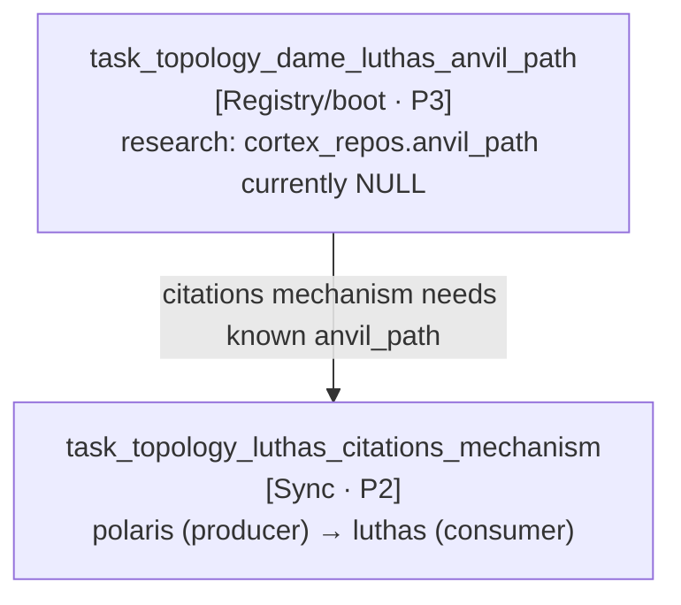

# Queued Backlog Sub-Plan — dame-luthas-app

Sub-plan for dame-luthas-app-owned items from the 2026-07-07 queued
backlog. Master DAG + cross-repo edges live in
`maximus-ai/docs/plans/QUEUED-BACKLOG-MASTER-PLAN-20260707.md`.

---

## Goals

- Sequence the two dame-luthas-app-owned topology follow-ups (ANVIL
  boot path research → citations mechanism design) with the explicit
  producer-side polaris counterpart tracked as a side-cite.
- Keep the cross-repo edge (polaris producer → luthas consumer) visible
  in the master DAG rather than duplicated here.
- Establish the `dep_lands` signal chaining between the two so a Wave 2
  dispatch does not fire before Wave 1's `cortex_repos.anvil_path`
  update lands.

## PR references

- Parent master plan: `maximus-ai/docs/plans/QUEUED-BACKLOG-MASTER-PLAN-20260707.md`
  (opened as part of this Phase B pass; URL recorded once created).
- This sub-plan PR: opened as part of this Phase B pass; URL recorded
  in the Change Log row after `gh pr create`.

---

## 1. Items in this sub-plan

| # | id | pri | surface | layer | signal |
|---|----|-----|---------|-------|--------|
| 4 | task_topology_luthas_citations_mechanism_20260707 | P2 | Sync mechanism | Tier 1 | `dep_lands:task_topology_dame_luthas_anvil_path_20260707` |
| 6 | task_topology_dame_luthas_anvil_path_20260707 | P3 | Registry/boot | Tier 1 | `manual` (research) |

### Cross-repo note (project-polaris side)

Item 4 has a producer-side counterpart in project-polaris (the resume
tailoring pipeline's bundle output emits citation payloads). Producer
work is a single-mechanism change; it is tracked as a follow-up
side-cite under item 4's parent CORTEX task (`output_blob.polaris_note`)
rather than a separate polaris sub-plan.

---

## 2. Repo-local DAG

---

## 3. Wave sequencing

- **Wave 1** — `task_topology_dame_luthas_anvil_path` — research the
  canonical ANVIL boot path for dame-luthas-app; populate
  `cortex_repos.anvil_path`.
- **Wave 2** — `task_topology_luthas_citations_mechanism` — design +
  implement bundle-citations handoff mechanism (charter §1 E1); wire
  polaris producer → luthas consumer via the now-known anvil path.

---

## 4. Execution recipe (per item)

Each item is delivered via the following governed pipeline:

1. **plan-audit-fix** — Phase 1 PLAN (fetch `origin/main`, PAC scan,
   blast radius), Phase 2 audit-fix-plan (fix the target artifact inline).
   Skill: `documentation-standards/skills/plan-audit-fix/SKILL.md`.
2. **Four-gate stack** (bounded fix loop, 1 iteration each):
   - `forecast-scrutiny` — blast radius + reversal-cost check.
   - `MALFIG` gate — G3 (no-op detection), G6 (path guard), G8 (CORTEX
     hygiene), G11 (plan completeness via
     `maximus-ai/scripts/validate-plan-completeness.mts`), G13
     (separation of duties).
   - `forensic-auditing` — Rule 1 (verify-then-write), Rule 4
     (session-artifact hygiene), Rule 5 (Tier 3 duplicate-law scan).
   - `doc-forensic-inventory` — downstream link + manifest drift.
3. **Merge** — squash-merge on all-4-PASS with human authorization
   inherited from `merge_authorization` frontmatter; G13 forbids the
   executing agent from self-approving.

---

## 5. Non-goals

- Do NOT design or implement the citations mechanism in this pass
  (planning only).
- Do NOT alter project-polaris' resume-tailoring pipeline as part of
  luthas-side execution — producer changes happen under polaris' own
  execution lane.

---

## Change Log

| Version | Date | Author | Change |
|---------|------|--------|--------|
| 1.0.0 | 2026-07-07 | plan-by-surface-repo-layer-signal (skill v1.0.0) | Initial sub-plan — 2 items sequenced across 2 waves |
